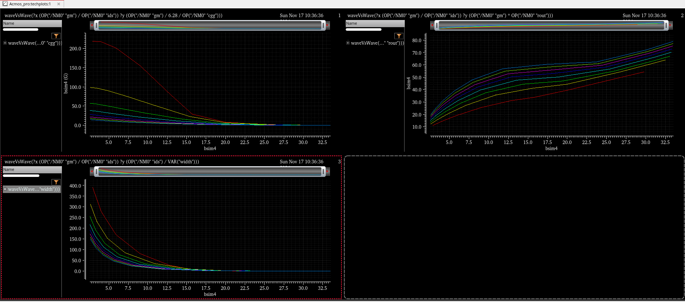
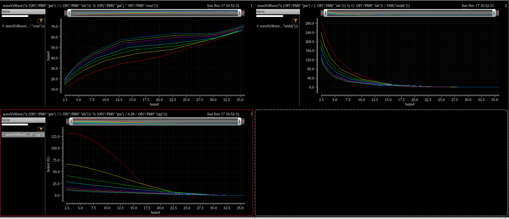

# Analog CMOS Final Project: LDO Design in GPDK 45nm Technology Node

This repository contains the deliverables and documentation for the Analog CMOS Final Project, where we design an LDO (Low Dropout Regulator) using the GPDK 45nm technology node. The project employs the gm/id methodology to generate technology-specific plots and design the LDO circuit.

---

## Table of Contents

- [Project Overview](#project-overview)  
- [Methodology](#methodology)  
  - [Technology-Specific Plots](#technology-specific-plots)  
  - [gm/id Methodology](#gmid-methodology)  
  - [Simulation Setup](#simulation-setup)  
- [LDO Design Circuit](#ldo-design-circuit)  
- [Author](#author)

---

## Project Overview

The primary goal of this project is to design an LDO using the GPDK 45nm Process Design Kit (PDK). Key deliverables include generating technology-specific plots using Cadence and MATLAB, documenting the gm/id methodology, and designing the LDO tailored to the GPDK 45nm node.

---

## Methodology

### Technology-Specific Plots

Using the GPDK 45nm PDK, the following technology-specific plots were generated to evaluate transistor performance.  

## **NMOS Circuit in Cadence**  

#### NMOS Plots
1. **\( g_m * r_o \) vs. \( g_m / I_D \)** 

  

2. **\( I_D / W \) vs. \( g_m / I_D \)**  

  

3. **\( f_t \) vs. \( g_m / I_D \)**  

  
---
## **PMOS Circuit in Cadence**  

#### PMOS Plots
1. **\( g_m * r_o \) vs. \( g_m / I_D \)**  
  

2. **\( I_D / W \) vs. \( g_m / I_D \)**  
  

3. **\( f_t \) vs. \( g_m / I_D \)**  
  

---

### Cadence Screenshots
- **NMOS Simulation in Cadence**  
  

- **PMOS Simulation in Cadence**  
  

### gm/id Methodology  

The gm/id methodology provides an efficient design framework for analog circuits, as it combines key performance metrics like transconductance efficiency, intrinsic gain, and transition frequency into intuitive plots. The design steps involved:  

1. Extract device parameters using DC simulations in Cadence.  
2. Generate CSV data for \( g_m \), \( r_o \), \( I_D \), and other parameters.  
3. Use MATLAB to plot \( g_m / I_D \) against other metrics.

### Simulation Setup

1. **Environment**: Cadence Virtuoso and MATLAB.  
2. **Simulation Tools**: Cadence ADE was used to extract CSV data for both NMOS and PMOS devices.  
3. **MATLAB Processing**: A custom MATLAB script processed the CSV data and generated the plots.

---

<!-- ## LDO Design Circuit  

### Schematic
Include a well-labeled image of the LDO schematic designed in Cadence.  

- **Cadence Schematic Screenshot**  

### Key Design Considerations  

- Biasing of transistors tailored to the GPDK 45nm node.  
- Power efficiency and output voltage stability under varying loads.  
- Compensation to ensure frequency stability.  

--- -->

<!-- ## Author  

**[Your Full Name]**  
[Your Email Address]  
[Your GitHub Profile Link]   -->

Feel free to reach out for further queries or discussions on the project!  
